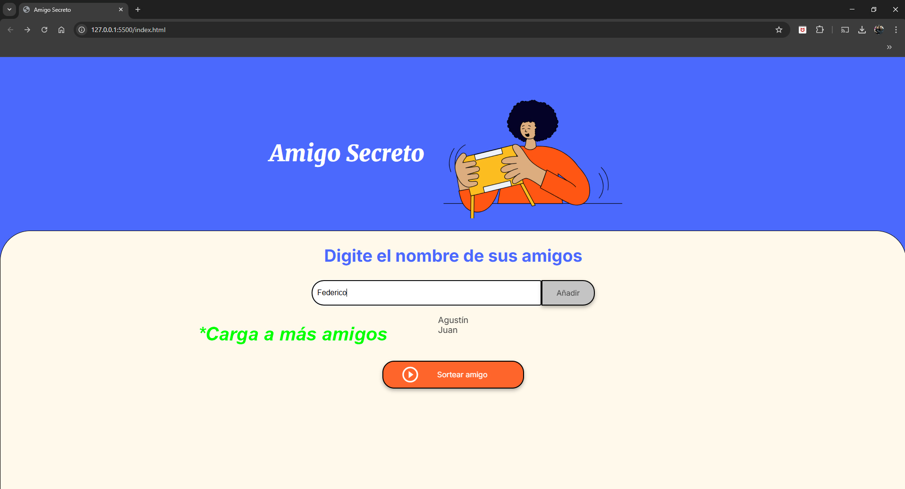

<h1>Juego del amigo secreto</h1>

El juego consiste en completar una lista con todos tus amigos y luego elegir al azar a uno solo y ese será el ¡GANADOR!

- Primer paso: Ingrese el nombre de uno de sus amigos.

- Segundo paso: Agregue el amigo a la lista haciendo "CLICK" en el botón "AÑADIR".

Tu amigo fue agregado correctamente.

- Repetí los pasos 1 y 2 las veces que creas necesarias.

- Cuando ya tengas a todos tus amigos cargados, hace "CLICK" en "SORTEAR AMIGO".

¡LISTO! ya tienes al ¡GANADOR!.

Esto fue un Challenge realizado para el curso de programación de ORACLE y Alura Latam.

<h1>¡Espero que te diviertas!</h1>